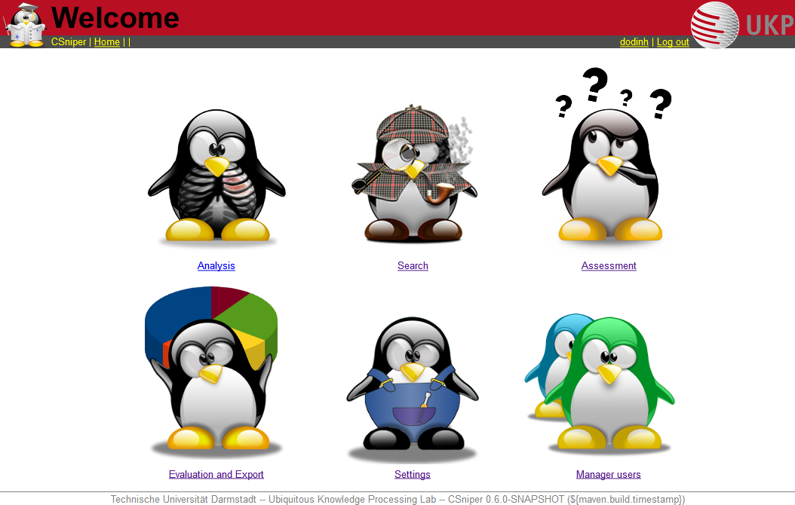
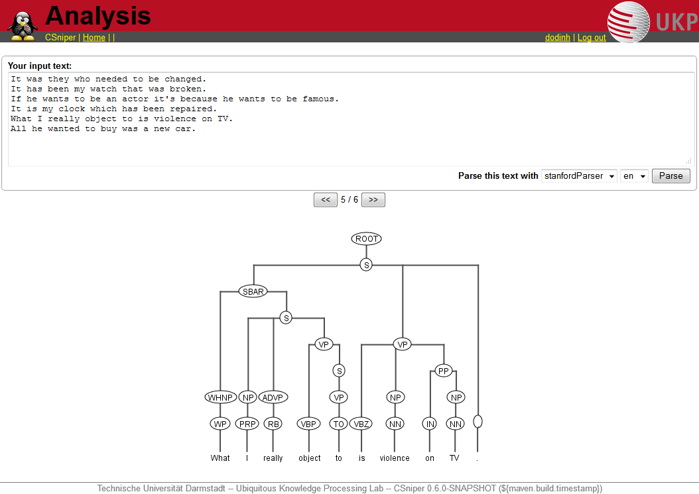
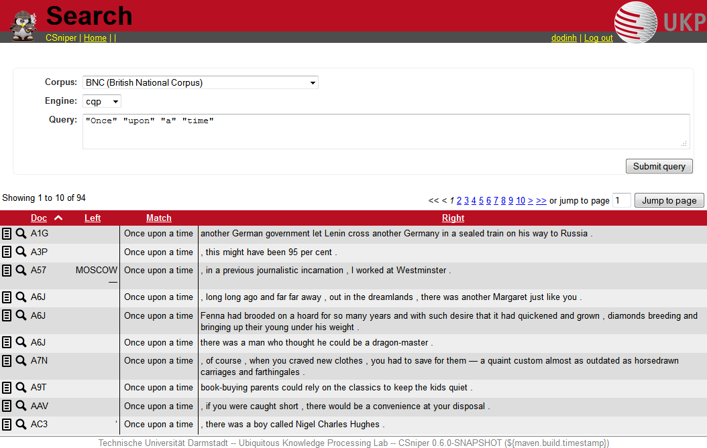
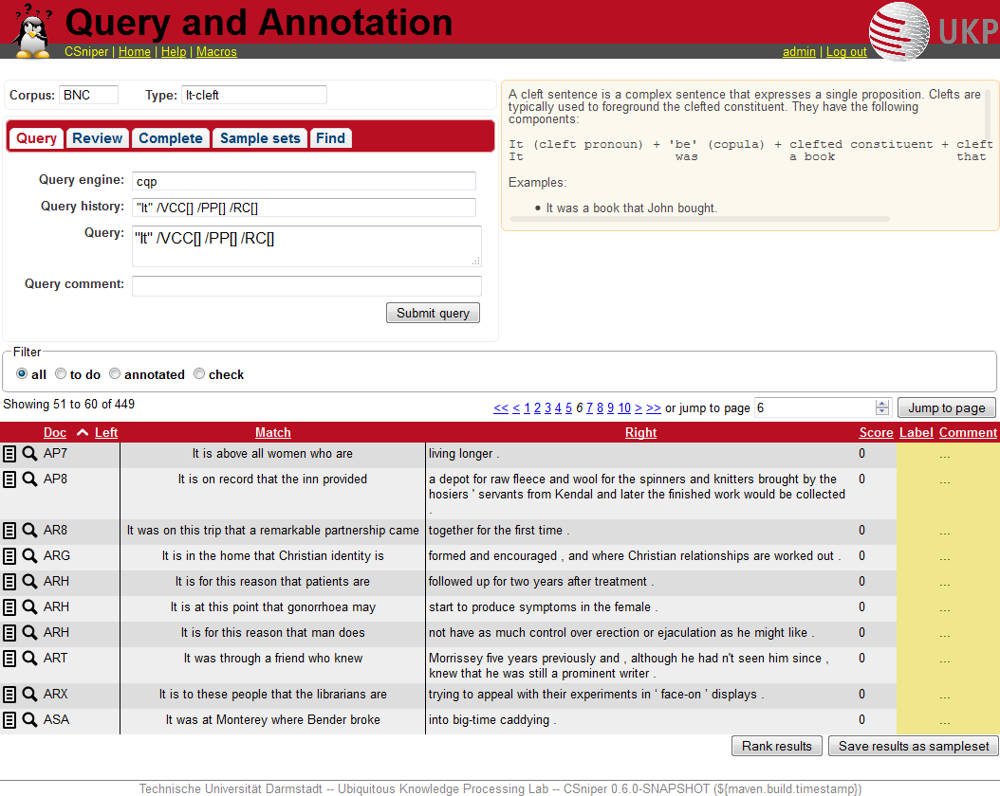
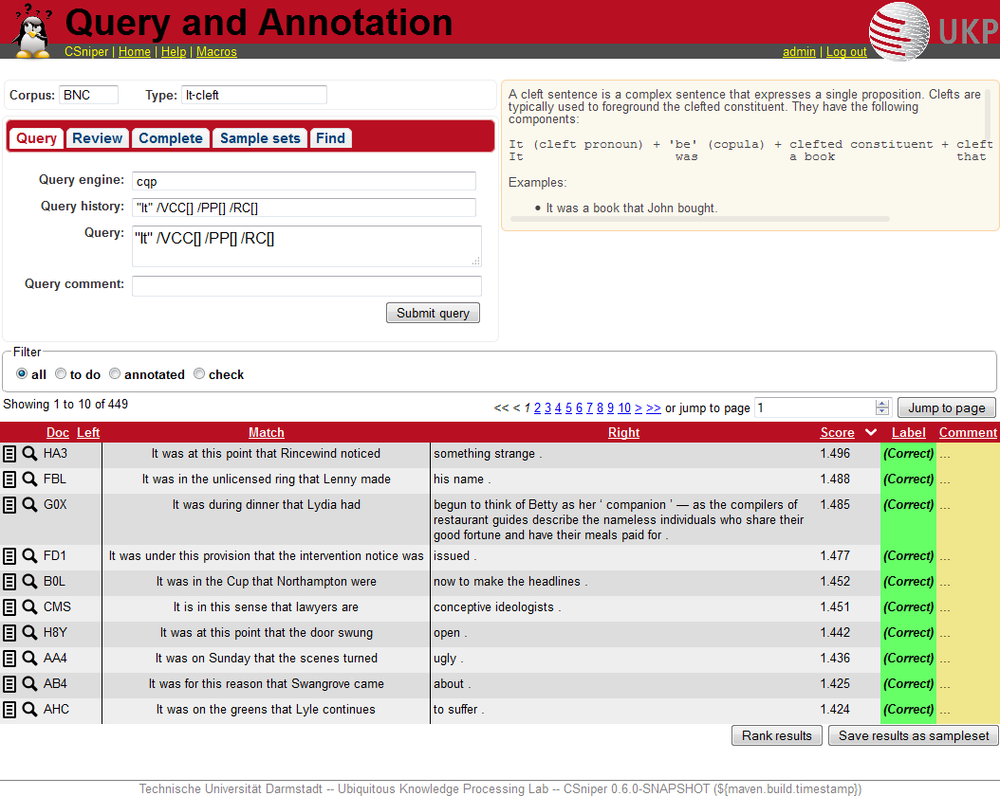
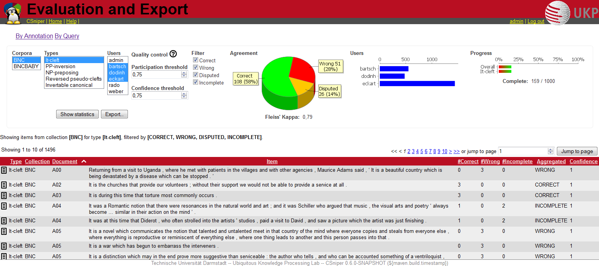
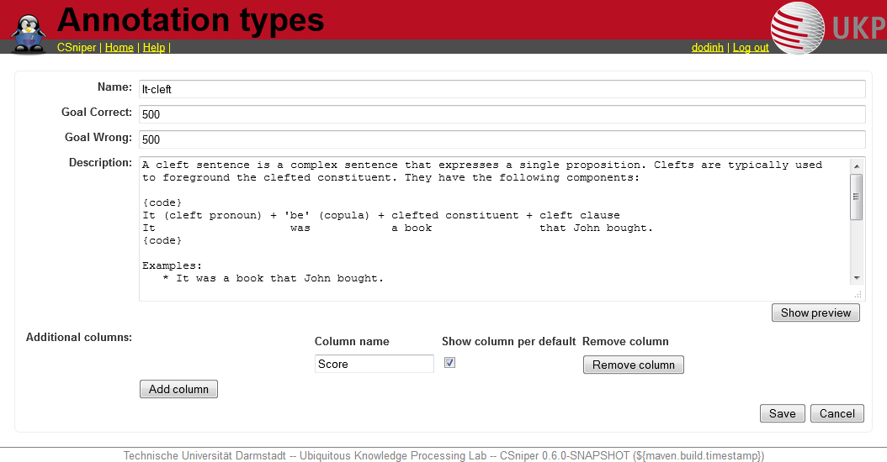
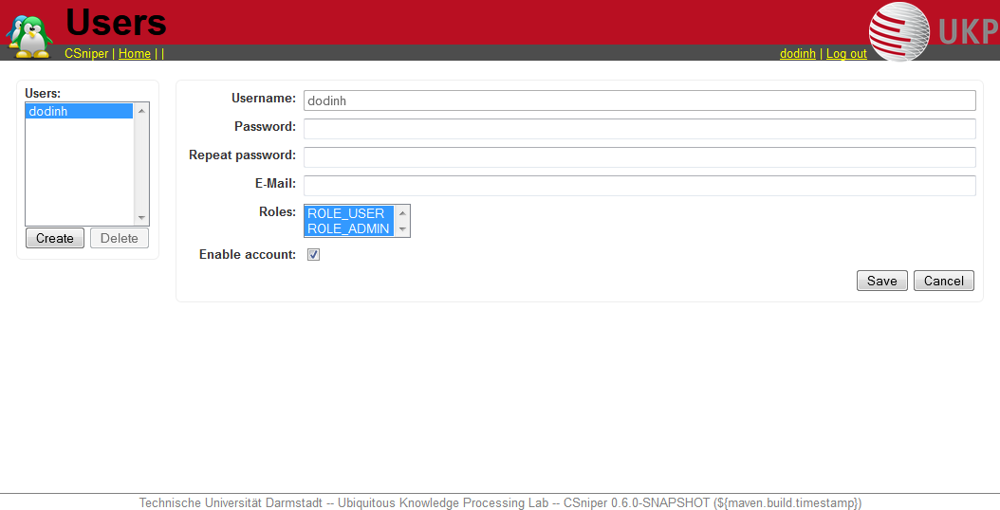

**Content**
{: #toc }
*  TOC
{:toc}

<!-- /.medium-4.columns -->

The aim of this guide is to show most of CSniper's functions and how to make use of them.
When you visit you CSniper page, you are first greeted with a login screen. Supply your login data and proceed.

## Overview

Choose any of these actions:

- *[Analysis](#analysis)* - Show parse trees for sentences
- *[Search](#search)* - Conduct a corpus search
- *[Assessment](#assessment)* - Do a corpus search and assess the found items
- *[Evaluation and Export](#evaluation-and-export)* - See statistics about your project, export
- *[Settings](#settings)* - Add or edit annotation types
- *[Manage users](#manage-users)* - Add, edit, remove users

The last two items are only available to users with an administrator role.

## Analysis

This page offers constituent parsing of user-entered sentences. Simply enter a sentence, choose a parser (CSniper comes with the OpenNLP parser preconfigured), and click "Parse" - you'll be presented with an image showing the parse tree.

## Search

This page is useful if you don't want to do a full blown annotation query, but just check and run some superficial tests. You cannot annotate on this page, and results and queries will not be saved.
To start a search, you have to choose a corpus and an engine, then enter a query in the engine's syntax and click "Submit query". You are then shown a table of results.

The two icons to the left of each entry provide additional insight into an item:

- The magnifier icon opens an overlay window which contains the parse tree for the specific sentence.
- The text icon opens a text box at the bottom of the table which shows the corpus context for the specific sentence.

## Assessment

This is the main component of CSniper. Here you can create a CQP query, usually based on POS tags, lemmas, word forms, depending on what is encoded in your corpus.

The workflow looks like this: first, choose a corpus to work on, and the **type** of phenomenon you want to search and create annotations for. You then will be shown the query box, where you can select the query engine (*cqp* or *tgrep*) and enter a query (and an optional comment). 

After pressing **Submit query** you will be shown the results in keywords-in-context (KWIC) view. If the results don't look appropriate to you, you can just enter a new query - otherwise, press **Start annotation**. This opens up a new column in the KWIC view, where you can label each sentence as containing the specific phenomenon or not.

Since annotating can take quite some time, there is also the option to use **Rank results**. This function re-orders the results, showing the ones first which are most probably **Correct**, i.e. instances of the phenomenon; they have to be confirmed manually. Since the ranking is learned from your annotations (and the annotations of your co-annotators), it can only be useful after annotating some instances. You can re-rank at any time, to refine the ordering.

We also have implemented an experimental **Find mode**, which you can activate in a tab at the top of the query box. Here, you do not supply a query, but instead the ranking function tries to find instances from the corpus, based on the annotations you have made in previous sessions.

Other tab options are

- **Review** - shows you the annotations you have alreay made for this type
- **Complete** - show you the sentences which have been annotated by other annotators, but not you
- **Sample sets** - *description coming soon*

## Evaluation and Export

You can evaluate your annotation experiments, selecting different options to gain insight into inter-annotator-agreement or look at sentences which have been annotated differently by annotators. 

Select the corpus and phenomenon type to show agreement for, and also which annotators should be taken into account.
You can select to show only sentences which have been labeled **Correct** by all chosen annotators, similar for **Wrong**, **Disputed** and **Incomplete** sentences. You can also set two thresholds, participation threshold and confidence threshold, both between 0 and 1:

- **participation** - this regulates which percentage of the selected users has to have annotated a sentence, so that it does not count as **Incomplete**
- **confidence** - this regulates when a sentence is labeled as **Disputed**; for an explanation see the graphic below

These settings also influence what gets exported when you press the "Export" button; supported export file formats are HTML, CSV, and XLS.

You can also show statistics for queries by clicking on **By Query**.

## Settings

On this page you can create new annotation types (i.e. name of a phenomenon to be annotated) or edit existing ones.

Each type has to be given a unique name, and you can also set annotation goals. A short but precise description is useful for your annotators, who can refer to this description when annotating. *Show preview* let's you see how the description will be seen on the Assessment page (you can use Creole Wiki syntax here; find out more by clicking help in the navigation bar). You can also add custom columns which will be shown in the result table. They can be used by the annotators to leave notes or additional information.
Don't forget to save!

## Manage users

Here you cann add or delete users, and also set an initial password (or a new password should they have forgotten theirs).
Because the name is a unique identifier, you can only set it once.
You can also disable accounts, and assign roles. Each user has to have the ROLE_USER role, you may also assign ROLE_ADMIN, which gives this user access to the settings and users pages.

<!-- /.medium-8.columns -->

<!-- /.row -->
